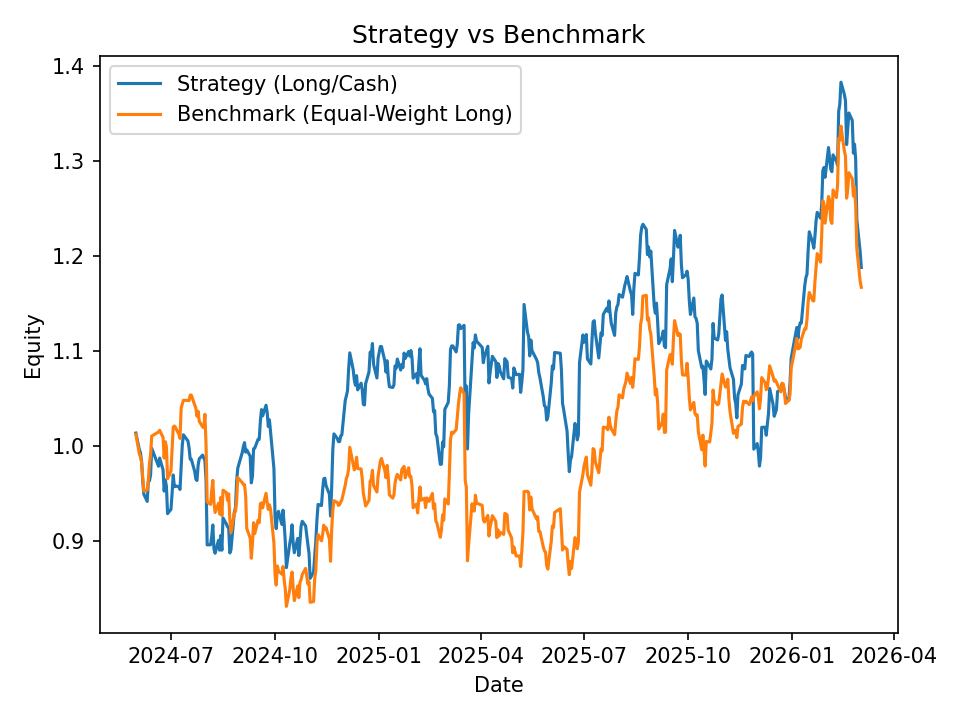
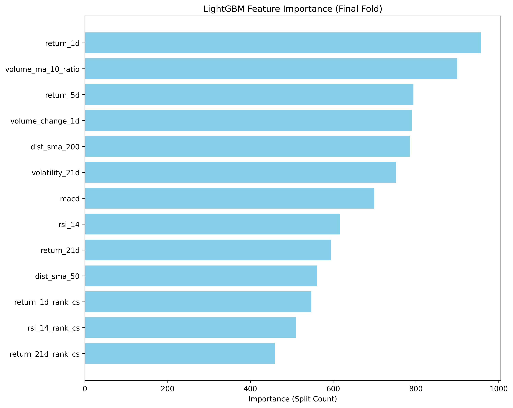

# BIST30 Machine Learning Stock Selection

This project builds a machine learning pipeline to predict next-day stock direction for BIST30 equities and construct a cross-sectional portfolio strategy.

The model ranks stocks daily based on predicted probabilities and constructs a **Top-K portfolio**.
---
Repository Structure

src/
  data_loader.py      → data download & processing
  features.py         → feature engineering
  splits.py           → walk-forward splits
  train.py            → model training
  backtest.py         → portfolio backtesting

results/
  figures/            → strategy charts
  metrics/            → OOF predictions
  backtests/          → backtest statistics
---

# Project Pipeline

Data Collection  
→ Feature Engineering  
→ Walk-forward Training  
→ Out-of-Fold Predictions  
→ Cross-Sectional Ranking  
→ Top-K Portfolio Construction  
→ Backtesting & Benchmark Comparison

The pipeline is designed to avoid **look-ahead bias and data leakage**.

---

# Features Used

The model uses several categories of features:

### Momentum
- 1-day return
- 5-day return
- 21-day return

### Trend Indicators
- RSI
- MACD
- Moving Average distance (SMA50 / SMA200)

### Volatility
- 21-day realized volatility

### Volume Signals
- volume change
- volume moving average ratio

### Cross-sectional ranking
Some features are ranked daily across stocks to capture **relative strength signals**.

---

# Strategy

Instead of predicting the market direction, the model ranks stocks cross-sectionally.

Each day:

1. Stocks are ranked by predicted probability
2. The top **K stocks** are selected
3. An equal-weight portfolio is constructed

Tested portfolios:

- Top 3
- Top 5
- Top 10

---

# Backtest Results

Best performing strategy:

**Top-5 portfolio**

Cumulative Return: **18.8%**  
Sharpe Ratio: **0.48**  
Max Drawdown: **-20%**

---

# Strategy vs Benchmark

The ML strategy shows the ability to capture **cross-sectional alpha** relative to the benchmark.

---

# Feature Importance

The model relies primarily on:

- short-term momentum
- volume anomalies
- volatility signals

---

# Transaction Cost Analysis

Cost sensitivity test:

| Cost | Sharpe |
|-----|------|
0 bps | 1.07  
10 bps | 0.48  
20 bps | negative

This shows the strategy generates alpha but is sensitive to **transaction costs due to high turnover**.

---

# Technologies

Python  
Pandas  
Scikit-learn  
LightGBM  
Pandas-ta  
Matplotlib  

---
# How to Run

Install dependencies

pip install -r requirements.txt

Train the model

python -m src.train

Run the backtest

python -m src.backtest

# Disclaimer

This project is for **research purposes only** and does not constitute financial advice.
